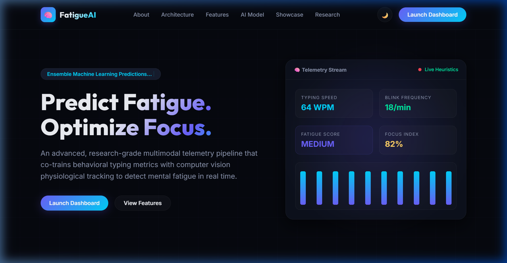
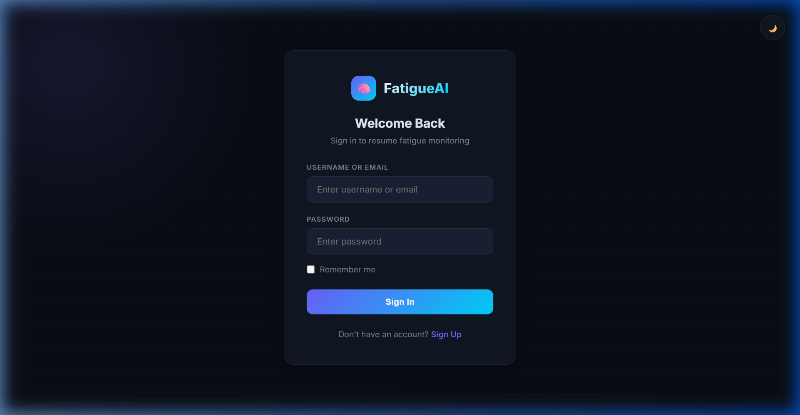
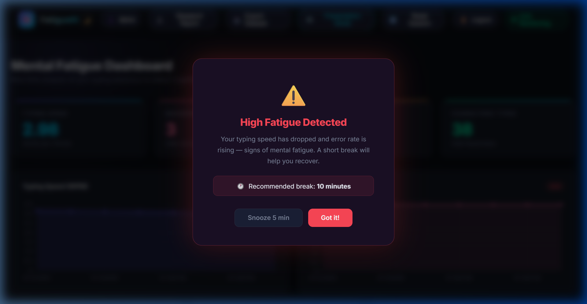
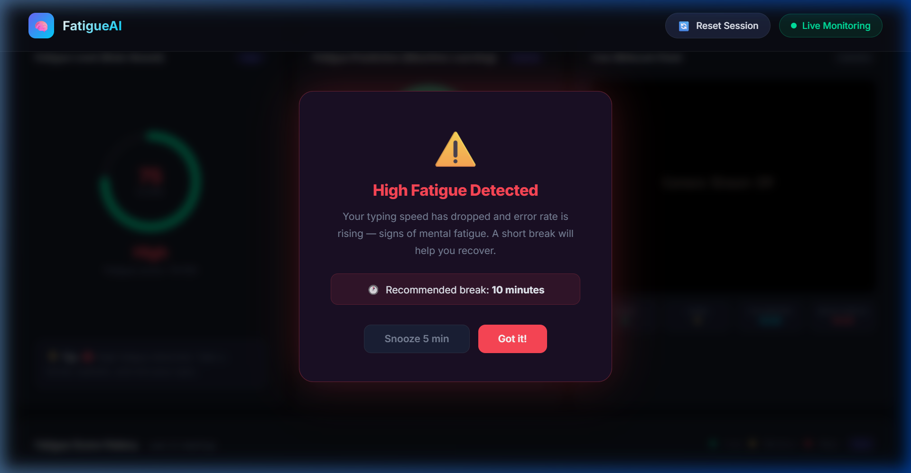
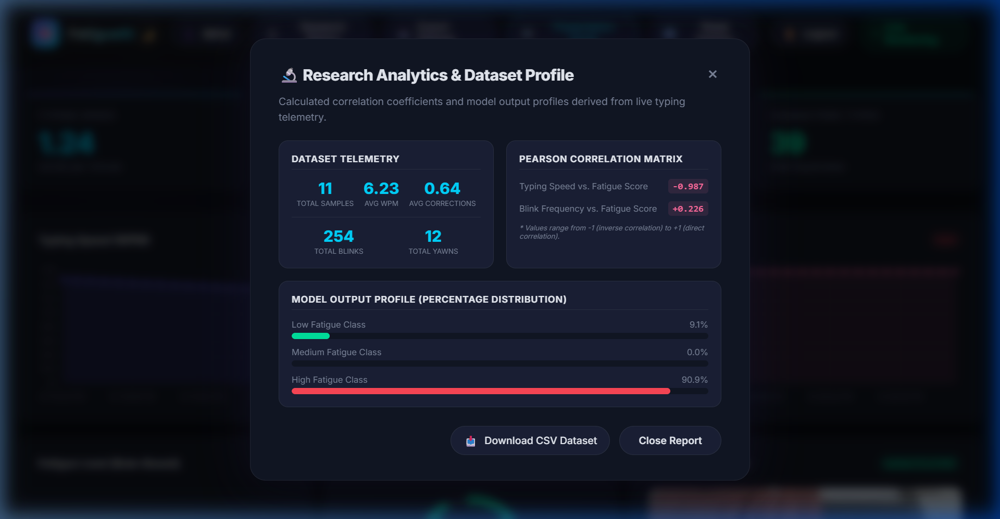
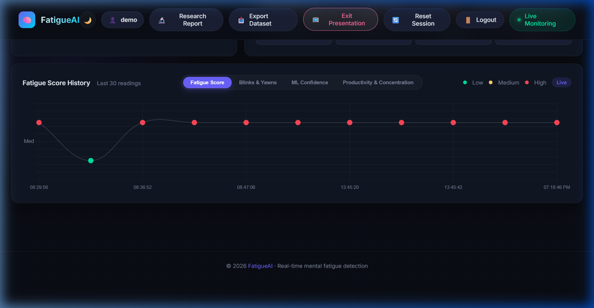

# FatigueAI

> **Real-Time Multimodal Mental Fatigue Detection & Explainable AI Analytics Platform**

[](https://www.python.org/)
[](https://flask.palletsprojects.com/)
[](https://scikit-learn.org/)
[](https://mediapipe.dev/)
[](https://www.sqlite.org/)

An advanced, research-grade multimodal AI telemetry platform designed to predict cognitive and physical fatigue in real time. The system co-trains behavioral keystroke metrics with physiological facial landmarks (blinks, yawning, and eye/mouth aperture), classifying states via a Random Forest Ensemble and exposing explanations through an Explainable AI (XAI) reasoning engine.

---

## 🎨 Screenshots & Visual Walkthrough

### 1. Premium Welcome Page
A glassmorphic marketing landing page explaining project telemetry, pipeline execution, and features:


### 2. Sign In Portal
Recruiter-friendly entry screen featuring credentials forms and direct demonstration CTA bypasses:


### 3. Dashboard Overview
Multi-modal live panels showing WPM counters, error rates, and historic connection line charts:


### 4. Webcam Physiological Tracker
MediaPipe facial mesh coordinates extracting blinks and yawn statistics dynamically:


### 5. Research Analytics Report Modal
Real-time calculations of Pearson Correlation Coefficients ($r$) and database distributions:


### 6. Recruiter Presentation Mode
Adaptable responsive view that collapses logs history lists and expands line graphs and camera streams:


---

## 🚀 Key Features

*   **Multimodal Telemetry Fusion**: Co-trains real-time keyboard speed (WPM) and correction frequency (backspace rates) with facial biometrics.
*   **Physiological Video Analytics**: MediaPipe FaceMesh tracks Eye Aperture Ratio (EAR) and Mouth Stretch Ratio (MAR) to count blinks and yawns dynamically.
*   **Ensemble Classifier**: Random Forest Ensemble balances features to resist camera dropouts, falling back gracefully to typing heuristics.
*   **Explainable AI (XAI) Core**: Evaluates productivity indices, concentration ratios, and provides step-by-step diagnostic reasoning.
*   **Recruiter Demo Access**: Instant validation via the public landing page **🎯 Recruiter Demo** CTA which bypasses registration using pre-seeded, safe recruiter credentials (`demo` / `demo123`).
*   **📺 Recruiter Presentation Mode**: Instantly hides debugger logs, expands line charts to full width, stretches webcam video feeds, and refits Chart.js layouts for large screens.
*   **Startup Validation Suite**: Automates hardware, database schema, package dependency, and binary model verification on startup.

---

## 🛠️ System Architecture & Data Pipeline

```
                     +---------------------------+
                     |        User Inputs        |
                     +-------------+-------------+
                                   |
            +----------------------+----------------------+
            |                                             |
   +--------v--------+                           +--------v--------+
   |  Keyboard Hook  |                           |  Webcam Camera  |
   | (WPM & Errors)  |                           | (FaceMesh EAR)  |
   +--------+--------+                           +--------+--------+
            |                                             |
            +----------------------+----------------------+
                                   |
                          +--------v--------+
                          |    Flask App    +<--------+ Startup System
                          | (Gunicorn Core) |         | Check Diagnostics
                          +---+----+----+---+         | (Env / Schema)
                              |    |    |             |
                +-------------+    |    +-------------+
                |                  |
       +--------v--------+   +-----v-----+
       |  Random Forest  |   | SQLite DB |
       |   Classifier    |   |  & CSV    |
       +--------+--------+   +-----------+
                |
       +--------v--------+
       | Explainable AI  |
       | (Focus & Rules) |
       +--------+--------+
                |
       +--------v--------+
       | Premium UI / XAI|
       | & CSV Exporter  |
       +-----------------+
```

---

## 💻 Technical Stack

*   **Backend**: Flask (Python) with Gunicorn WSGI.
*   **Frontend**: Vanilla HTML5, CSS3 Custom Properties (Glassmorphism), and Javascript (Chart.js canvas bindings).
*   **Machine Learning**: Scikit-Learn Random Forest Classifier, Joblib serialization.
*   **Computer Vision**: OpenCV frame processing, Google MediaPipe landmarks mesh extraction.
*   **Database & Storage**: SQLite relational database, isolated user CSV datasets.

---

## ⚙️ Local Setup and Installation

### 1. Prerequisites
*   Python 3.10+
*   USB Webcam / Integrated Camera (Optional, fallback heuristics will run if offline)

### 2. Environment Configuration
Navigate to the root directory, create a virtual environment, and install dependencies:
```bash
# Create virtual environment
python -m venv venv

# Activate on Windows (PowerShell)
.\venv\Scripts\Activate.ps1

# Activate on Linux/MacOS
source venv/bin/activate

# Install package dependencies
pip install -r requirements.txt
```

### 3. Setup Secret Variables
Create a local configuration `.env` file by copying the template:
```bash
cp .env.example .env
```
Default parameters inside `.env`:
*   `SECRET_KEY`: A unique secure session token.
*   `DATABASE_URL`: Location for the SQLite analytics db.
*   `FLASK_DEBUG`: Toggle debugging console messages (set to `False` in production).

### 4. Running the Server
Start the Flask application:
```bash
python app.py
```
Upon startup, the console diagnostic suite will verify all subsystems:
```
======================================================================
                  FATIGUEAI STARTUP SYSTEM DIAGNOSTICS               
======================================================================
   [OK]   ML Classifier Model Binary Verification                    
   [OK]   Webcam Hardware Capture Verification                       
   [OK]   SQLite Database Analytics Schema Verification              
   [OK]   Active Virtual Environment Package Verification            
----------------------------------------------------------------------
 SUCCESS: All core services loaded. Running in standard multi-modal mode.
======================================================================
```
Open your browser and navigate to `http://127.0.0.1:5000/`.

---

## 🎯 Recruiter Demonstration Credentials

Bypass registration using the safe pre-seeded recruiter test credentials:
*   **Direct Access**: Click **🎯 Recruiter Demo Access** on the landing page hero section.
*   **Manual Access**:
    - **Username**: `demo`
    - **Password**: `demo123`

---

## 🚀 Cloud Deployment Instructions

FatigueAI is configured for instant cloud deployment (e.g. Render, Railway) via Gunicorn.

### Render Deployment (Recommended)
1. Create a **Web Service** on Render connected to your GitHub repo.
2. Set build command: `pip install -r requirements.txt`
3. Set start command: `gunicorn app:app`
4. Add environment variables: `SECRET_KEY`, `FLASK_DEBUG=False`, `DATABASE_URL=sqlite:///database/fatigue_analytics.db`.

### Railway Deployment
1. Create a **New Project** and deploy from GitHub repository.
2. Railway will automatically read `Procfile` and deploy using Gunicorn.
3. Configure environment variables in the variables tab.

---

## 📊 Telemetry API Reference

| Endpoint | Method | Description |
| :--- | :--- | :--- |
| `/` | GET | Renders the primary welcome marketing landing page. |
| `/login` | GET/POST| Renders the standard authentication panel. |
| `/demo-login` | GET | Direct login bypass for recruiters to inspect features instantly. |
| `/dashboard` | GET | Renders the main telemetry dashboard (requires auth). |
| `/api/stats` | GET | Returns live keyboard typing metrics (WPM, errors, elapsed time). |
| `/api/fatigue` | GET | Returns rule-based fatigue level and triggers log writes. |
| `/api/predict-fatigue` | GET | Runs real-time Random Forest multi-class model predictions. |
| `/api/webcam-status` | GET | Returns status and active metrics of the MediaPipe/OpenCV tracker. |
| `/api/explain` | GET | Computes concentration score indices, productivity levels, and trends. |
| `/api/logs` | GET | Fetches the recent 50 session telemetry records from the database. |
| `/api/diagnostics` | GET | Returns startup checks diagnostics and runtime PID metrics. |
| `/api/research-report` | GET | Returns calculated dataset metrics and Pearson correlation coefficients. |
| `/api/export-csv` | GET | Streams the SQLite session log history as a downloadable CSV dataset file. |
| `/api/reset` | POST | Truncates database and restarts the active monitoring session. |
| `/video_feed` | GET | Renders the webcam video feed overlaid with facial coordinates. |

---

## 🔬 Scientific Methodology & Analytics

### 1. Physiological Telemetry (EAR/MAR)
Uses vertical eyelid distances and lip opening dimensions to count blinks and yawns dynamically:
$$\text{EAR} = \frac{||p_2 - p_6|| + ||p_3 - p_5||}{2 ||p_1 - p_4||}$$

### 2. Pearson Correlation Coefficients ($r$)
Evaluates linear relationships between keyboard speeds/blink frequencies and computed fatigue levels:
$$r = \frac{n \sum xy - (\sum x)(\sum y)}{\sqrt{[n \sum x^2 - (\sum x)^2][n \sum y^2 - (\sum y)^2]}}$$

### 3. Random Forest Ensemble
A balanced bootstrap aggregation of decision tree models trained to predict fatigue states (LOW/MEDIUM/HIGH) from co-trained typing speeds and facial EAR metrics. It retains high accuracy even in cases of camera disconnects.

---

## 🗺️ Future Scope

*   **Custom Calibration**: Add a 1-minute keystroke and eye focus calibration routine on registration.
*   **Enrichment Features**: Integrate heart rate estimation (rPPG) from webcam video streams to add cardiovascular variables.
*   **Telemetry Extractor Extension**: Release Chrome extensions or desktop background daemons to track typing speed globally across all applications.

---

## 📄 License

Distributed under the MIT License. See `LICENSE` for details.
